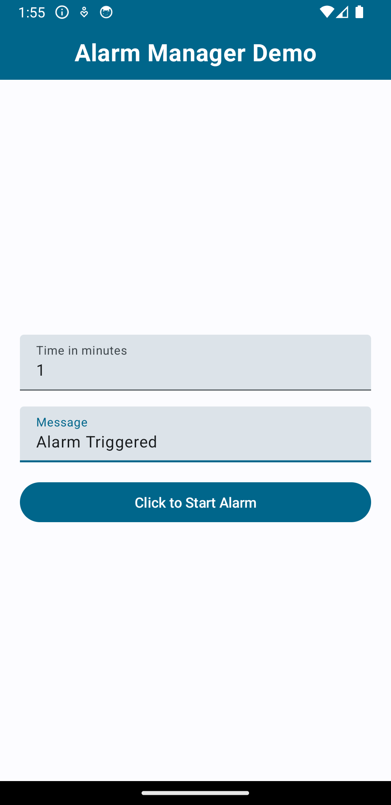

# AlarmManager Demo

## Description

AlarmManager Demo is an educational project showcasing the implementation of the AlarmManager Android API within a Kotlin-based application. This project serves as a comprehensive example for developers looking to integrate time-sensitive tasks and reminders into their Android apps.

Utilizing the power of Jetpack Compose for the UI layer, AlarmManager Demo demonstrates modern UI development practices. It follows the MVVM (Model-View-ViewModel) architecture, promoting separation of concerns and maintainability. Additionally, the codebase adheres to clean code principles, ensuring readability and extensibility.

Through this project, developers can gain insights into scheduling periodic tasks, setting one-time or repeating alarms, handling time-sensitive events, and managing alarms effectively in their applications. 

## Screenshot

## Table of Contents

- [Installation](#installation)
- [Usage](#usage)
- [Contributing](#contributing)
- [License](#license)

## Installation

1. Clone the repository:
   git clone https://github.com/rahulgothwal5/AlarmManager-Demo.git
2. Open the project in Android Studio.

## Usage

Explore the codebase to learn how to integrate AlarmManager into your Kotlin Android app using Jetpack Compose and MVVM architecture.

## Contributing

1. Fork the repository.
2. Create a new branch (`git checkout -b feature/your-feature-name`).
3. Make your changes.
4. Commit your changes (`git commit -am 'Add new feature'`).
5. Push to the branch (`git push origin feature/your-feature-name`).
6. Create a new Pull Request.

## License

This project is licensed under the [MIT License](LICENSE).
